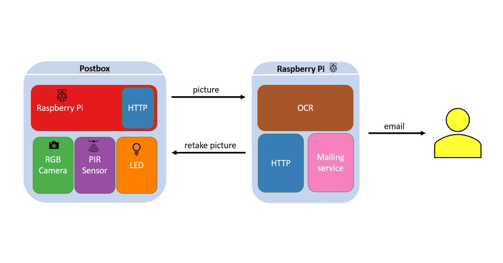
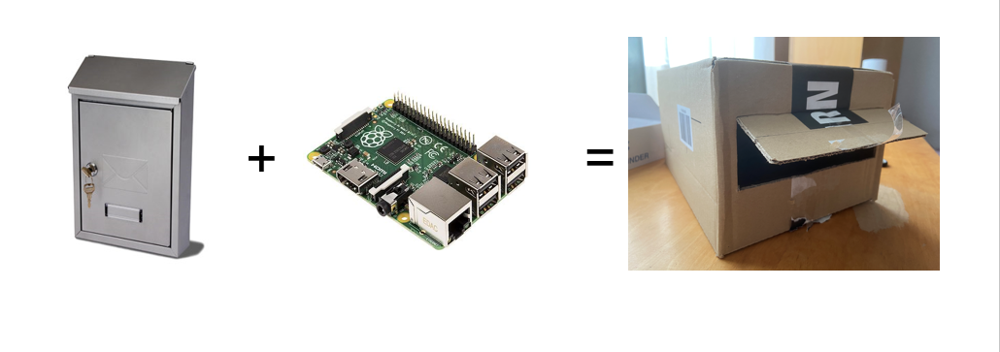
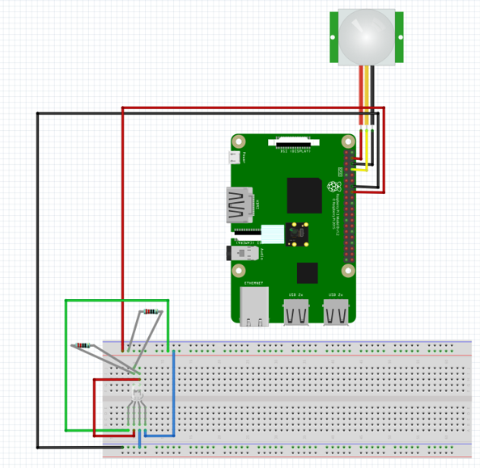
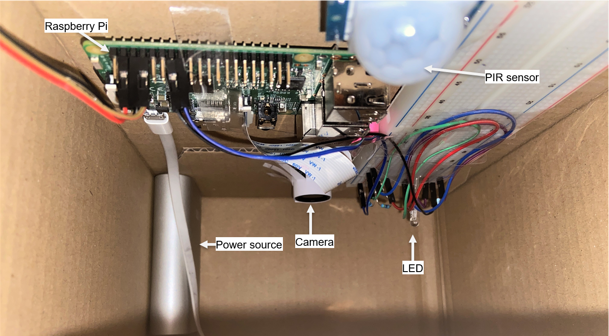
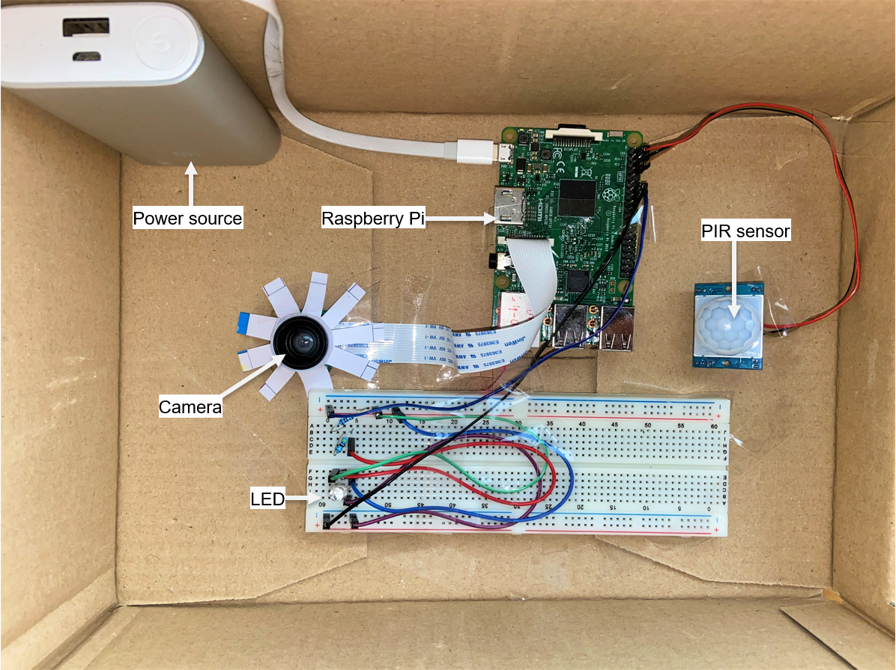
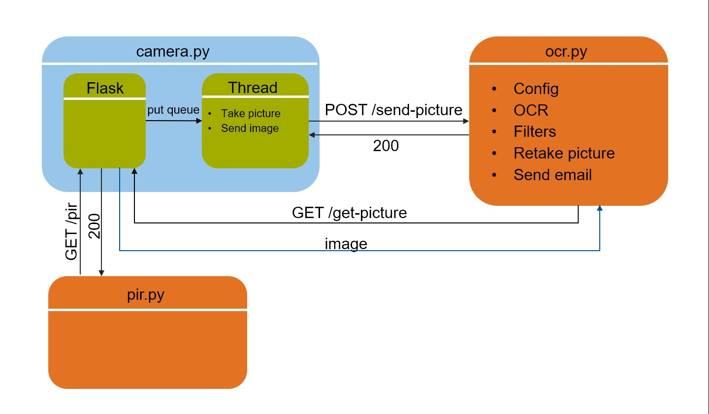

- [smart-postbox](#smart-postbox)
  * [Main idea](#main-idea)
  * [Prototype](#prototype)
  * [Used components](#used-components)
  * [Setup on 1st Raspberry Pi](#setup-on-1st-raspberry-pi)
  * [Data Flow](#data-flow)
  * [Configure](#configure)
  * [How to use](#how-to-use)
 

# smart-postbox

## Main idea:

## Prototype

## Used components:
<pre>
2 x Raspberry Pi 3 Model B
1 x Picamera
1 x PIR motion sensor
1 x RGB LED
1 x Breadborad
1 x Powerbank for the Raspberry Pi in the postbox
3 x femmale-to-female cable
2 x male-to-female cable
3 x male-to-male cable
Resistor(s) for LED
</pre>

## Setup on 1st Raspberry Pi

# Data Flow

# Configure
1. first configure Google Vision API and get your key
2. then create a file named "credentials" containing sender_email, sender_password, receiver_email like below:
<pre>
sender@example.com
password1234
receiver@example.com
</pre>

# How to use
1. run [pir.py](pir.py) on the 1st Raspberry Pi 
<pre>$ python3 pir.py</pre>
2. run [camera_2.py](camera_2.py) using Flask on the 1st Raspberry Pi  
<pre>
$ export FLASK_APP = camera_2.py
$ pyhton3 camera2.py
</pre>
3. Start Google Vision by exporting your key on the 2nd Raspberry Pi
<pre>$ export GOOGLE_APPLICATION_CREDENTIALS=your_google_vision_key.json</pre>
4. run [ocr.py](ocr.py) using Flask on the 2nd Raspberry Pi 
<pre>
$ export FLASK_APP = ocr.py
$ flask run
</pre>

[pir.py](pir.py) runs on the Raspberry Pi inside postbox, detects new post insertion  
[camera_2.py](camera_2.py) runs on the Raspberry Pi inside postbox, takes a picture of the post and sends it to the 2nd Raspberry Pi  
[ocr.py](ocr.py) run on the 2nd Raspberry Pi, detects text on the post, applies filters and sends email  

